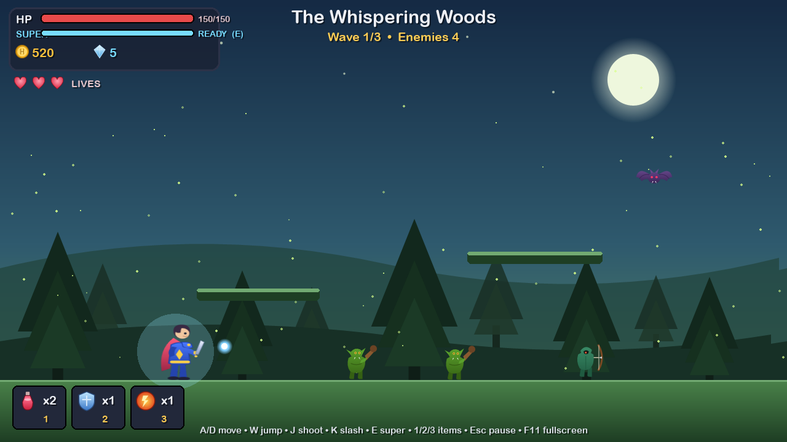
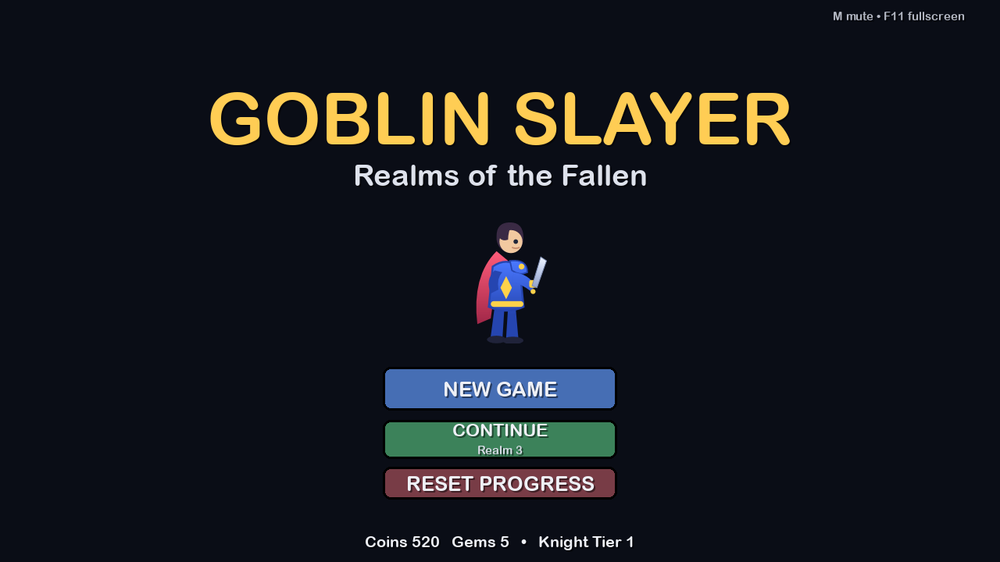
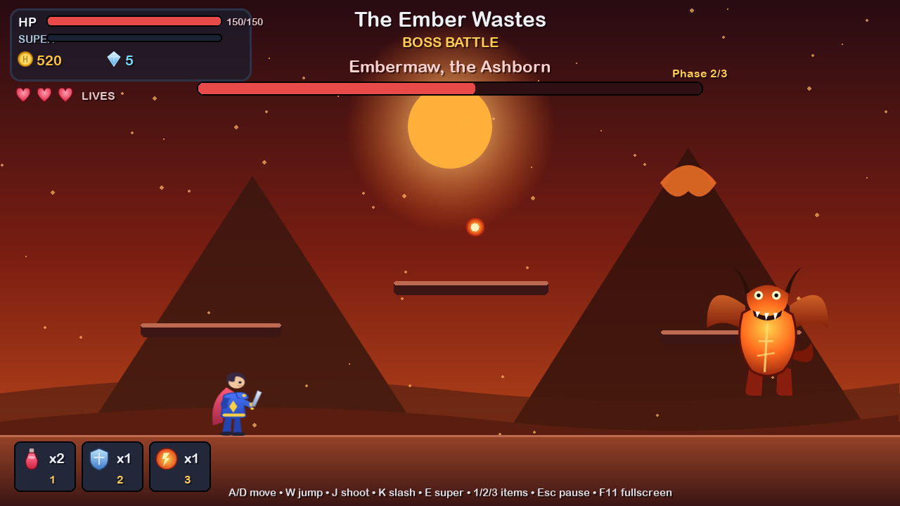
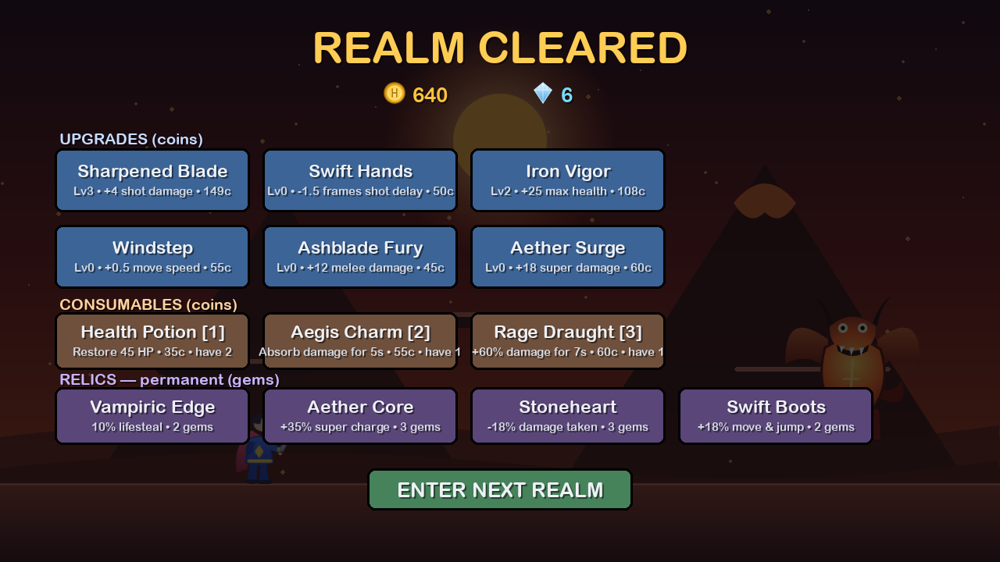

<h1 align="center">⚔️ Goblin Slayer: Realms of the Fallen</h1>

<p align="center">
  <b>A complete, production-grade action-platformer built in Python + pygame-ce —
  where every character, enemy, boss and background is generated procedurally as SVG.</b>
</p>

<p align="center">
  
  
  
  
</p>

<p align="center">
  
</p>

---

## 🖼️ Screenshots

<table>
  <tr>
    <td width="50%"></td>
    <td width="50%"></td>
  </tr>
  <tr>
    <td align="center"><i>Title screen — New Game / Continue</i></td>
    <td align="center"><i>Boss battle — Embermaw, phase 2</i></td>
  </tr>
  <tr>
    <td width="50%"></td>
    <td width="50%"></td>
  </tr>
  <tr>
    <td align="center"><i>Shop — upgrades, consumables & relics</i></td>
    <td align="center"><i>Combat in the Whispering Woods</i></td>
  </tr>
</table>

---

## 📖 Overview

What started as a single static screen with one patrolling goblin is now a full game.
You play **Kael, the last Ashblade knight**, fighting through three corrupted realms to
reclaim the stolen **Aether Crystals** and end the Goblin King's reign over the fallen
kingdom of **Aethermoor**.

Every visible sprite — the hero, enemies, bosses, item icons, and the multi-layer
parallax backgrounds — is **authored as SVG in code** (`goblinslayer/art.py`) and
rasterised through pygame-ce's built-in vector loader. There are **no external image
files** for any of the artwork; it's all generated on first run into `assets/svg/`.

## 📜 Story

> The kingdom of Aethermoor has fallen. The Goblin King's legions boil out of the earth,
> and the three Aether Crystals that held the realms in balance have been torn away.
> One knight remains. Cross the **Whispering Woods**, brave the **Ember Wastes**, and
> scale the **Frozen Citadel** — slay the guardian of each realm, reclaim its crystal,
> and carry the light back to a broken world.

## ✨ Features

### Combat & feel
- **Real platformer physics** — gravity, jump arcs, acceleration/friction, one-way
  platforms, knockback, and invulnerability frames.
- **Natural, weighty attacks** — a rapid ranged bolt with recoil kickback and a
  close-range **melee slash** with its own arc hitbox.
- **Charging Super attack** — the *Aether Surge* meter fills as you deal damage and land
  kills (and trickles slowly over time). When it's ready, unleash a screen-clearing
  **nova** that damages everything and wipes enemy projectiles.
- **Consumables** used mid-battle with number keys: **Health Potion**, **Aegis Charm**
  (temporary shield), and **Rage Draught** (temporary +damage).

### Enemies & bosses
- **Three enemy archetypes** — melee grunts, ranged archers, and swooping bats — each
  with distinct AI, scaling in strength every realm.
- **Three unique bosses**, each with a **fully randomised, phase-based AI**. Bosses pick
  their next move at random from a phase-dependent pool, and *every parameter* — attack
  choice, projectile counts, spread angles, speeds, telegraph and recovery timing — is
  randomised each time. At 66% and 33% HP they **enrage** into new, faster phases with
  extra attacks. **The patterns are genuinely unpredictable — no fixed rotation to memorise.**

| Boss | Realm | Signature moves |
|------|-------|-----------------|
| **Grukk the Warlord** | Whispering Woods | Charge, ground-slam shockwaves, axe throws, phase-3 quake |
| **Embermaw, the Ashborn** | Ember Wastes | Hovering fireball volleys, aimed bursts, dives, phase-3 inferno rain |
| **The Goblin King** | Frozen Citadel | Radial ice spreads, aimed shards, blink-teleports, phase-3 blizzard |

### Living, moving worlds
- **Three realms**, each a distinct **scrolling parallax background** (sky + far + mid
  layers moving at different speeds) so the world feels alive even when you stand still.
- **Ambient weather** per realm — drifting fireflies, rising embers, falling snow.
- **Per-realm gameplay modifiers**: the Ember Wastes rains **meteors** from the sky; the
  Frozen Citadel has a **slippery ice floor** where momentum carries you.

### Progression & meta
- **Rewards** — enemies drop coins and hearts; bosses drop coins and **gems**.
- **Between-realm shop** with three tiers of spending:
  - **6 upgrades** (coins): damage, fire rate, max HP, speed, melee, super damage.
  - **3 consumables** (coins) to stock up before the next fight.
  - **4 permanent relics** (gems): lifesteal, faster super charge, damage reduction, and
    a mobility boost.
- **Your knight visibly evolves** through three armour tiers (blue → crimson → violet,
  each with an aura) as you invest in upgrades and relics.
- **Lives system** — start each run with 3 lives and respawn on death until they run out.
- **Save / load** — coins, gems, upgrades, consumables and relics persist in
  `savegame.json`; the title screen offers **New Game** or **Continue** from your
  furthest realm.

### Presentation & UX
- **Resolution-independent rendering** — the game draws to a fixed 1280×720 logical
  canvas and scales to any window size with letterboxing. **Resizable window** and
  **fullscreen** (F11), fully responsive.
- Particle effects, camera shake, screen flash, floating damage numbers, health & boss
  bars, and a full set of screens: **title, story, pause, shop, game over, victory**.
- Background music and sound effects (with an **M** mute toggle).

## 🎮 Controls

| Action | Keys |
| ------ | ---- |
| Move | `A` / `D` or `←` / `→` |
| Jump | `W` / `↑` / `Space` |
| Shoot | `J` / `Ctrl` |
| Melee slash | `K` / `L` |
| **Super attack** (when charged) | `E` / `Q` |
| Use Health Potion / Shield / Rage | `1` / `2` / `3` |
| Pause | `Esc` / `P` |
| Fullscreen | `F11` |
| Mute music | `M` |
| Confirm menus | `Enter` / `Space` or mouse click |

## 🚀 Installation & running

Requires **Python 3.10+**.

```bash
# 1. clone
git clone <your-repo-url>
cd Goblin-Pygame

# 2. create & activate a virtual environment
python -m venv venv
#   Windows:
venv\Scripts\activate
#   macOS / Linux:
source venv/bin/activate

# 3. install dependencies
pip install -r Requirements.txt

# 4. play!
python main.py
```

On first launch the game generates all SVG art into `assets/svg/` automatically.

## 🎨 Regenerating / previewing the art

All art is code. You can regenerate every SVG on its own:

```bash
python -m goblinslayer.art      # (re)writes all SVGs to assets/svg/
```

Tweak colours, shapes and palettes in `goblinslayer/art.py`, delete `assets/svg/`, and
rerun to see your changes.

## 🛠️ How it works (technical notes)

- **Procedural SVG art.** Sprites are built from SVG paths, shapes and gradients. A key
  detail: pygame-ce's nanosvg backend only honours gradients declared with
  `gradientUnits="userSpaceOnUse"` and absolute coordinates, and transparency via
  `stop-opacity` (8-digit hex alpha renders black) — the helpers in `art.py` handle this.
  Vectors are rasterised at exact target sizes with `load_sized_svg` for crispness at any
  resolution.
- **Animation** is done in-engine via transforms (bob, squash-and-stretch, flip, rotate)
  plus particles, so each character needs only a single detailed still.
- **Randomised boss AI** lives in `entities.Boss`: a small state machine
  (`idle → windup/charge/dive → execute → recover`) that re-rolls its action and all
  numeric parameters every cycle, gated by an HP-driven phase.
- **Resolution independence**: the whole frame renders to one logical `Surface`, then
  `_present()` scales it to the actual window and stores the transform so mouse input maps
  back to logical coordinates.

## 📁 Project layout

```
main.py                      # launcher / entry point
goblinslayer/
├── config.py                # all tunables: resolution, stats, stages, waves,
│                            #   upgrades, consumables, relics, palette
├── art.py                   # procedural SVG generation + crisp surface loading/caching
├── background.py            # scrolling parallax layers + ambient weather particles
├── entities.py              # player, enemies, bosses, projectiles, pickups, particles
├── progression.py           # upgrades, currency, consumables, relics, save/load
├── ui.py                    # HUD, health/super/boss bars, buttons, panels
└── game.py                  # state machine, main loop, responsive rendering, ctx API
Game/                        # audio assets (music + SFX)
assets/svg/                  # generated SVG art (created on first run; git-ignored)
savegame.json                # player progress (created on play; git-ignored)
```

## ⚖️ Balancing

Nearly everything a designer would want to tune is centralised in
[`goblinslayer/config.py`](goblinslayer/config.py): player base stats, super-charge
rates, upgrade curves, consumable/relic effects, per-stage waves and behaviours, and
enemy/boss stats. Change a number, relaunch — no logic edits required.

## 📝 License

MIT — see below. All art and code in this repository are original and generated
procedurally; you're free to use, modify and learn from them.

<details>
<summary>MIT License</summary>

```
MIT License

Permission is hereby granted, free of charge, to any person obtaining a copy
of this software and associated files, to deal in the Software without
restriction, including without limitation the rights to use, copy, modify,
merge, publish, distribute, sublicense, and/or sell copies of the Software.

THE SOFTWARE IS PROVIDED "AS IS", WITHOUT WARRANTY OF ANY KIND.
```
</details>

---

<p align="center"><i>Reclaim the crystals. Restore Aethermoor. Become the legend.</i></p>
